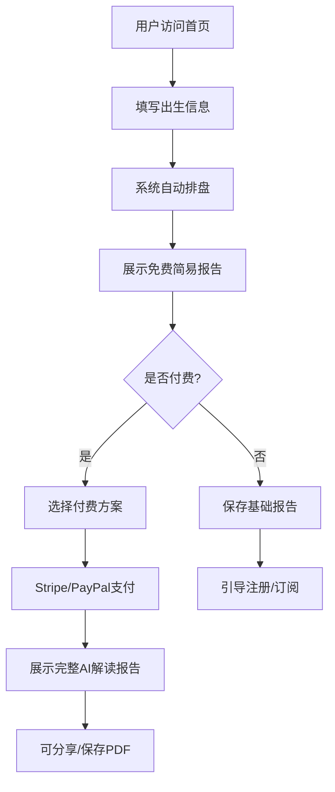

# 产品需求文档 (PRD) - DestinyMap Bazi Reading Platform

## 1. 产品概述

DestinyMap 是一款面向海外用户的英文生辰八字（Bazi / Chinese Astrology）AI 算命解读平台。用户输入公历出生日期、时间和地点，系统自动排盘并生成心理学疗愈风格的AI解读报告。产品定位东方传统文化 + 心理娱乐解读，主打欧美、东南亚灵性市场。

- 目标用户：欧美、东南亚、海外华人年轻群体，热衷星座塔罗、愿意为个人命运解读付费的外籍用户
- 市场价值：海外神秘学/灵性市场2032年预计达2490亿美元，八字解读客单价可达$60+，复购率40%

## 2. 核心功能

### 2.1 用户角色

| 角色 | 注册方式 | 核心权限 |
|------|----------|----------|
| 普通用户 | 邮箱注册 / 访客模式 | 免费简易报告、付费完整报告 |
| 会员用户 | 订阅付费 | 无限次命盘解读、合盘匹配、年度运势 |
| 管理员 | 后台登录 | 用户管理、订单管理、内容配置 |

### 2.2 功能模块

1. **首页 (Landing Page)**: 品牌展示、服务介绍、用户录入入口、定价方案
2. **命盘录入页 (Bazi Input)**: 极简表单收集出生信息，自动换算八字
3. **报告展示页 (Report Display)**: 可视化命盘 + AI解读报告（性格/感情/事业/运势）
4. **合盘匹配页 (Compatibility)**: 情侣八字合盘，匹配度分析
5. **支付页 (Pricing & Payment)**: 订阅方案选择，Stripe/PayPal支付
6. **用户中心 (User Dashboard)**: 历史报告、会员状态、账户设置
7. **后台管理 (Admin Panel)**: 用户管理、订单统计、报告管理

### 2.3 页面详情

| 页面名称 | 模块名称 | 功能描述 |
|----------|----------|----------|
| 首页 | Hero区域 | 全屏沉浸式背景，品牌标语，CTA按钮引导录入 |
| 首页 | 服务介绍 | 四宫格展示：性格分析/感情合盘/事业财运/年度运势 |
| 首页 | 定价方案 | 三栏定价卡：免费/月订阅$9.9/年订阅$79 |
| 首页 | 文化转译说明 | 五行→Elements，十神→Personality Archetypes等 |
| 命盘录入 | 出生信息表单 | 日期选择器、时间选择器、城市输入、性别选择 |
| 命盘录入 | 实时预览 | 输入后实时显示八字四柱 |
| 报告页 | 命盘可视化 | 圆形命盘图，五行能量条，十神分布 |
| 报告页 | 性格特质 | Personality Profile，Strengths & Weaknesses |
| 报告页 | 感情婚恋 | Love & Compatibility分析 |
| 报告页 | 事业财运 | Career & Money解读 |
| 报告页 | 运势预测 | Annual Forecast + Monthly Forecast |
| 合盘页 | 双人录入 | 双方出生信息输入 |
| 合盘页 | 匹配报告 | 匹配度评分，相处建议，冲突预警 |
| 支付页 | 方案选择 | 单次报告$9.9 / 月订阅$9.9 / 年订阅$79 |
| 支付页 | 支付集成 | Stripe信用卡 / PayPal |
| 用户中心 | 历史报告 | 已生成的报告列表，支持重新查看 |
| 用户中心 | 会员管理 | 当前套餐、续费、取消订阅 |
| 后台管理 | 仪表盘 | 用户数、订单数、收入统计 |
| 后台管理 | 用户列表 | 查看/编辑/禁用用户 |
| 后台管理 | 订单管理 | 查看订单详情，处理退款 |

## 3. 核心流程

### 3.1 主用户流程

用户访问首页 → 点击"Discover Your Destiny" → 填写出生信息 → 系统排盘 → 展示免费简易报告 → 引导升级完整报告 → 选择付费方案 → 完成支付 → 展示完整AI解读报告 → 可分享/保存PDF

### 3.2 合盘匹配流程

用户登录 → 进入合盘页面 → 输入双方出生信息 → 系统计算合盘 → 展示匹配度分析 → 引导付费解锁完整合盘报告

### 3.3 订阅流程

用户选择订阅方案 → Stripe/PayPal支付 → 激活会员权益 → 无限次生成报告 → 到期提醒/自动续费

## 4. 用户界面设计

### 4.1 设计风格

- **主题风格**: 东方神秘学 × 现代极简主义。深色背景营造灵性氛围，金色/琥珀色作为点缀色传递贵气与能量感。
- **主色调**: 深墨黑 #0F0F0F（背景），暖金色 #D4A853（强调色/CTA），月白色 #F5F0E8（文字）
- **辅助色**: 朱砂红 #C73E3A（警示/重要），青黛色 #4A6741（五行木），琥珀色 #B87333（五行土）
- **按钮风格**: 圆角矩形（radius: 8px），金色渐变背景，hover时有微光扫过动画
- **字体搭配**: 
  - 标题：Cinzel（衬线体，古典优雅，传递东方神秘感）
  - 正文：Crimson Text（衬线体，阅读舒适，杂志感）
  - 辅助：Outfit（无衬线，现代简洁，用于标签和按钮）
- **布局风格**: 单页滚动 + 多页路由结合。首页全屏沉浸式，内页卡片式布局
- **图标风格**: Lucide React图标，细线风格，金色或白色

### 4.2 页面设计概述

| 页面名称 | 模块名称 | UI元素 |
|----------|----------|--------|
| 首页 | Hero区域 | 全屏深色背景+星空粒子动画，居中品牌名"DestinyMap"，副标题"Discover Your Chinese Astrology"，金色CTA按钮 |
| 首页 | 服务介绍 | 四列卡片，每卡有图标+标题+描述，hover时卡片上浮+边框发光 |
| 首页 | 定价方案 | 三列定价卡，中间年订阅卡突出显示（金色边框），勾选列表展示权益 |
| 命盘录入 | 表单区域 | 居中卡片，深色半透明背景，表单项：日期/时间/城市/性别，提交按钮带加载动画 |
| 报告页 | 命盘可视化 | 顶部圆形命盘SVG图，五行能量横向进度条，十神标签云 |
| 报告页 | 解读内容 | 手风琴折叠面板，每部分有图标+标题，展开显示AI生成的解读文本 |
| 合盘页 | 匹配结果 | 中央大圆环显示匹配度百分比，两侧显示双方命盘摘要，下方详细分析 |
| 支付页 | 方案选择 | 三列卡片式定价，选中状态金色边框高亮，底部集成Stripe支付表单 |

### 4.3 响应式设计

- **桌面端优先**: 最大宽度1440px，内容居中
- **平板适配**: 768px-1024px，网格变为2列，字体适当缩小
- **移动端适配**: <768px，单列布局，命盘图改为垂直排列，表单全宽
- **触摸优化**: 按钮最小高度48px，手风琴面板支持滑动展开

### 4.4 动画与交互

- **页面加载**: 品牌名逐字淡入动画，背景星空粒子缓慢漂移
- **滚动触发**: 服务介绍卡片依次从下方滑入（stagger: 0.1s）
- **Hover效果**: 卡片上浮+阴影加深，按钮金色光晕扩散
- **命盘生成**: 提交后显示加载动画（旋转的八卦符号），完成后命盘图从中心缩放出现
- **报告展开**: 手风琴面板展开时带弹簧物理动画
- **匹配度显示**: 数字从0滚动到最终值，圆环进度条同步动画

## 5. 内容合规与免责声明

- 全站页脚统一显示："For entertainment purposes only. Not intended as professional advice."
- 报告开头显示免责声明："This reading is based on traditional Chinese astrology and is meant for self-reflection and entertainment."
- 隐私政策页面：符合GDPR/CCPA，说明数据收集范围和使用方式
- 关键词规避：使用"Chinese Astrology" / "Bazi Reading" / "Destiny Analysis"，避免"算命"/"占卜"
