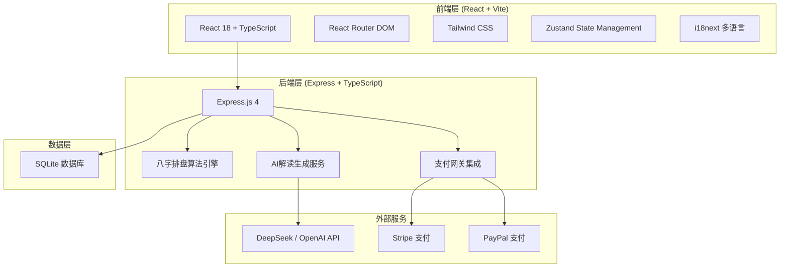
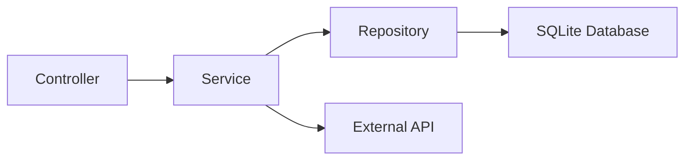
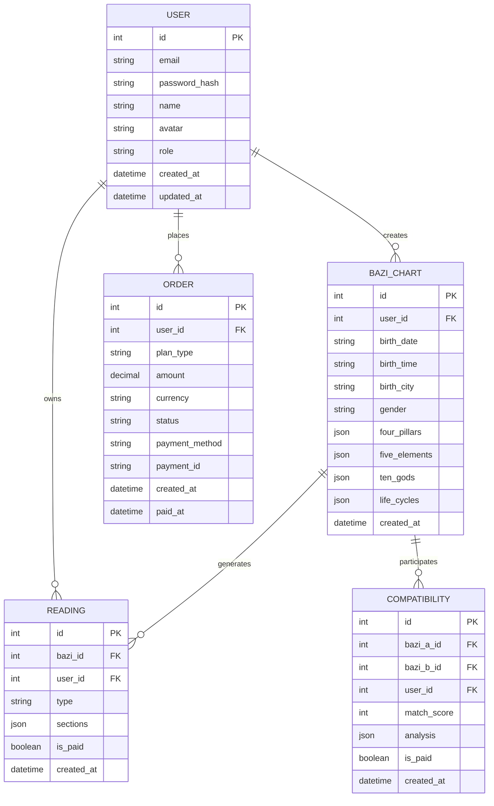

# 技术架构文档 - DestinyMap Bazi Reading Platform

## 1. 架构设计



## 2. 技术选型

- **前端框架**: React 18 + TypeScript
- **构建工具**: Vite 5
- **样式方案**: Tailwind CSS 3
- **状态管理**: Zustand
- **路由**: React Router DOM 6
- **国际化**: i18next + react-i18next
- **后端框架**: Express.js 4 + TypeScript
- **数据库**: SQLite（轻量，适合冷启动阶段）
- **AI接口**: DeepSeek API / OpenAI API（可配置）
- **支付**: Stripe + PayPal
- **图标**: Lucide React

## 3. 路由定义

| 路由 | 用途 |
|------|------|
| / | 首页 Landing Page |
| /input | 命盘信息录入 |
| /report/:id | 报告展示页 |
| /compatibility | 情侣合盘匹配 |
| /pricing | 定价与支付 |
| /dashboard | 用户中心 |
| /admin | 后台管理登录 |
| /admin/dashboard | 管理仪表盘 |
| /admin/users | 用户管理 |
| /admin/orders | 订单管理 |
| /privacy | 隐私政策 |
| /terms | 服务条款 |

## 4. API 定义

### 4.1 八字排盘 API

```typescript
// POST /api/bazi/calculate
interface CalculateBaziRequest {
  birthDate: string; // ISO date string
  birthTime: string; // HH:mm format
  birthCity: string;
  gender: 'male' | 'female';
  timezone?: string;
}

interface CalculateBaziResponse {
  id: string;
  fourPillars: {
    year: { stem: string; branch: string; element: string };
    month: { stem: string; branch: string; element: string };
    day: { stem: string; branch: string; element: string };
    hour: { stem: string; branch: string; element: string };
  };
  dayMaster: { stem: string; element: string; yinYang: string };
  fiveElements: { wood: number; fire: number; earth: number; metal: number; water: number };
  tenGods: Record<string, string>;
  lifeCycles: Array<{ age: number; stem: string; branch: string }>;
}
```

### 4.2 AI解读 API

```typescript
// POST /api/reading/generate
interface GenerateReadingRequest {
  baziId: string;
  type: 'basic' | 'full' | 'compatibility';
  sections?: string[]; // 指定生成哪些部分
}

interface GenerateReadingResponse {
  id: string;
  baziId: string;
  type: string;
  sections: Array<{
    title: string;
    content: string;
    icon: string;
  }>;
  createdAt: string;
}
```

### 4.3 合盘 API

```typescript
// POST /api/compatibility/calculate
interface CompatibilityRequest {
  personA: CalculateBaziRequest;
  personB: CalculateBaziRequest;
}

interface CompatibilityResponse {
  id: string;
  matchScore: number; // 0-100
  analysis: {
    overall: string;
    personality: string;
    love: string;
    challenges: string;
    advice: string;
  };
}
```

### 4.4 支付 API

```typescript
// POST /api/payment/create-intent
interface CreatePaymentIntentRequest {
  plan: 'single' | 'monthly' | 'yearly';
  paymentMethod: 'stripe' | 'paypal';
}

// POST /api/payment/confirm
interface ConfirmPaymentRequest {
  paymentIntentId: string;
}

// GET /api/subscription/status
interface SubscriptionStatusResponse {
  isActive: boolean;
  plan: string | null;
  expiresAt: string | null;
}
```

## 5. 后端架构



### 5.1 控制器层
- `BaziController`: 八字排盘相关接口
- `ReadingController`: AI解读生成接口
- `CompatibilityController`: 合盘匹配接口
- `PaymentController`: 支付相关接口
- `UserController`: 用户管理接口
- `AdminController`: 后台管理接口

### 5.2 服务层
- `BaziCalculationService`: 八字排盘核心算法
- `ReadingGenerationService`: AI解读报告生成
- `CompatibilityService`: 合盘匹配计算
- `PaymentService`: 支付处理
- `UserService`: 用户业务逻辑

### 5.3 数据访问层
- `UserRepository`: 用户数据操作
- `BaziRepository`: 命盘数据操作
- `ReadingRepository`: 解读报告数据操作
- `OrderRepository`: 订单数据操作

## 6. 数据模型

### 6.1 ER图



### 6.2 数据库DDL

```sql
-- 用户表
CREATE TABLE users (
    id INTEGER PRIMARY KEY AUTOINCREMENT,
    email TEXT UNIQUE NOT NULL,
    password_hash TEXT,
    name TEXT,
    avatar TEXT,
    role TEXT DEFAULT 'user',
    created_at DATETIME DEFAULT CURRENT_TIMESTAMP,
    updated_at DATETIME DEFAULT CURRENT_TIMESTAMP
);

-- 八字命盘表
CREATE TABLE bazi_charts (
    id INTEGER PRIMARY KEY AUTOINCREMENT,
    user_id INTEGER,
    birth_date TEXT NOT NULL,
    birth_time TEXT,
    birth_city TEXT,
    gender TEXT NOT NULL,
    four_pillars TEXT NOT NULL, -- JSON
    five_elements TEXT NOT NULL, -- JSON
    ten_gods TEXT NOT NULL, -- JSON
    life_cycles TEXT, -- JSON
    created_at DATETIME DEFAULT CURRENT_TIMESTAMP,
    FOREIGN KEY (user_id) REFERENCES users(id)
);

-- 解读报告表
CREATE TABLE readings (
    id INTEGER PRIMARY KEY AUTOINCREMENT,
    bazi_id INTEGER NOT NULL,
    user_id INTEGER,
    type TEXT NOT NULL,
    sections TEXT NOT NULL, -- JSON
    is_paid BOOLEAN DEFAULT 0,
    created_at DATETIME DEFAULT CURRENT_TIMESTAMP,
    FOREIGN KEY (bazi_id) REFERENCES bazi_charts(id),
    FOREIGN KEY (user_id) REFERENCES users(id)
);

-- 订单表
CREATE TABLE orders (
    id INTEGER PRIMARY KEY AUTOINCREMENT,
    user_id INTEGER,
    plan_type TEXT NOT NULL,
    amount DECIMAL(10,2) NOT NULL,
    currency TEXT DEFAULT 'USD',
    status TEXT DEFAULT 'pending',
    payment_method TEXT,
    payment_id TEXT,
    created_at DATETIME DEFAULT CURRENT_TIMESTAMP,
    paid_at DATETIME,
    FOREIGN KEY (user_id) REFERENCES users(id)
);

-- 合盘表
CREATE TABLE compatibilities (
    id INTEGER PRIMARY KEY AUTOINCREMENT,
    bazi_a_id INTEGER NOT NULL,
    bazi_b_id INTEGER NOT NULL,
    user_id INTEGER,
    match_score INTEGER,
    analysis TEXT NOT NULL, -- JSON
    is_paid BOOLEAN DEFAULT 0,
    created_at DATETIME DEFAULT CURRENT_TIMESTAMP,
    FOREIGN KEY (bazi_a_id) REFERENCES bazi_charts(id),
    FOREIGN KEY (bazi_b_id) REFERENCES bazi_charts(id),
    FOREIGN KEY (user_id) REFERENCES users(id)
);

-- 订阅表
CREATE TABLE subscriptions (
    id INTEGER PRIMARY KEY AUTOINCREMENT,
    user_id INTEGER UNIQUE NOT NULL,
    plan_type TEXT NOT NULL,
    status TEXT DEFAULT 'active',
    starts_at DATETIME DEFAULT CURRENT_TIMESTAMP,
    expires_at DATETIME,
    FOREIGN KEY (user_id) REFERENCES users(id)
);
```

## 7. 八字排盘算法说明

### 7.1 核心算法流程

1. **公历转农历**: 使用天文算法将公历日期转换为农历日期
2. **年柱计算**: 根据农历年份确定年干和年支
3. **月柱计算**: 根据农历月份和年干确定月干，月支固定
4. **日柱计算**: 使用已知的基准日期推算日干支
5. **时柱计算**: 根据出生时辰和日干确定时干，时支固定
6. **五行统计**: 统计四柱中各五行的数量
7. **十神推算**: 以日干为日主，推算各柱的十神关系
8. **大运排列**: 根据性别和年柱阴阳排列大运

### 7.2 天干地支对照表

- 天干: 甲(Jia), 乙(Yi), 丙(Bing), 丁(Ding), 戊(Wu), 己(Ji), 庚(Geng), 辛(Xin), 壬(Ren), 癸(Gui)
- 地支: 子(Zi), 丑(Chou), 寅(Yin), 卯(Mao), 辰(Chen), 巳(Si), 午(Wu), 未(Wei), 申(Shen), 酉(You), 戌(Xu), 亥(Hai)

## 8. AI解读生成策略

### 8.1 Prompt工程

- 系统Prompt设定AI为"资深东方命理学专家，擅长用西方心理学语言解读八字"
- 要求输出结构：性格特质/优缺点/感情/事业/运势
- 风格要求：积极正向、心理学疗愈向、故事化表达、弱化宿命论
- 术语转译：五行→Elements，十神→Personality Archetypes，大运→Life Cycles

### 8.2 缓存策略

- 相同八字的报告结果缓存，避免重复调用AI API
- 缓存有效期：30天

## 9. 支付集成

### 9.1 Stripe集成
- 使用Stripe Elements实现信用卡支付
- 支持订阅模式（月付/年付）
- Webhook处理支付状态变更

### 9.2 PayPal集成
- 使用PayPal Checkout SDK
- 支持一次性支付和订阅
- 回调处理支付结果

## 10. 安全与合规

### 10.1 安全措施
- 密码使用bcrypt加密存储
- API请求速率限制
- SQL注入防护（使用参数化查询）
- CORS配置

### 10.2 合规措施
- GDPR：支持用户数据导出和删除
- 全站免责声明
- 隐私政策页面
- 支付PCI合规（使用Stripe/PayPal托管支付页面）
